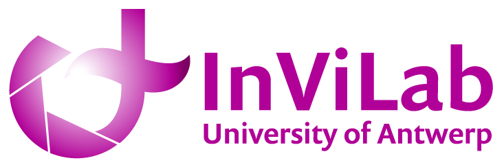

# InViLab - Industrial Vision Laboratory

<div align="center">
  
</div>


[](https://invilab.be)
[](https://genpycam.com)
[](https://linkedin.com/company/invilab-uantwerp)
[]([https://www.uantwerpen.be/en/research-groups/industrial-vision-lab](https://www.uantwerpen.be/en/research-groups/industrial-vision-lab/projects---publicati/))

## About Us

We are the **Industrial Vision Laboratory (InViLab)** at the University of Antwerp, a multidisciplinary research group pioneering machine vision solutions for industry and society. We develop cutting-edge imaging techniques for smart health, pollution monitoring, heritage conservation, and sustainable materials.

Our mission is to guide companies towards realizing better quality control, automation, and safety through state-of-the-art computer vision and machine learning techniques. We bring together experts in engineering, mathematics, physics, and chemistry to push the boundaries of machine vision and AI.

## 🚀 Featured Project: GenPyCam

**The World's First Generic Camera SDK Providing Quick and Easy Camera Capturing in Python**

> **🎉 Coming Soon!** GenPyCam will be released publicly soon. We are finalizing our toolbox and preparing for the beta release. Stay tuned for updates!

GenPyCam is our flagship open-source toolbox that simplifies industrial camera integration with just four lines of code:

```python
import genpycam as gpc
camera = gpc.Camera()
camera.start()
image = camera.get_image()
```

### Key Features:
- **Universal Compatibility**: Supports Allied Vision Technologies, Basler, FLIR, IDS, IFM, Specim, Xenics, Optris, Seek Thermal, and many more
- **Cross-Platform**: Works on Windows and Linux
- **Cross-Protocol**: Supports Ethernet, USB, and non-GenICam standards
- **Robust Error Handling**: Over 10,000 lines of connection error handling code
- **Easy Integration**: Install like any other Python library with pip

### Use Cases:
- **Prototyping & Technology Flexibility**: Rapid switching between camera technologies
- **In-situ Testing & Reliability**: Real-time quality control in production environments
- **Camera Fusion & Performance**: Intelligent combination of multiple camera viewpoints and technologies

## 🔬 Research Areas

### Medical & Biomedical Imaging
- **HyperStain**: Virtual slide staining through hyperspectral imaging and spectroscopy
- **3D Otoscopic Imaging**: Real-time eardrum surface measurement and pathology assessment
- **Optical Coherence Elastography**: In-vivo characterization of eardrum stiffness
- **Infrared Thermography**: Early skin cancer detection and breast reconstruction optimization
- **Wireless Capsule Endoscopy**: Enhanced imaging using Gaussian process latent variable models

### Industrial Applications
- **Vision4Food**: Machine vision automation for food industry production processes
- **MARISPEC**: Maritime infrastructure security through multi-wavelength drone surveillance
- **Additive Manufacturing**: Advanced measurement techniques for 3D printing quality control
- **Infrastructure Inspection**: Automated drone-based damage detection for bridges, wind turbines, and buildings

### Cultural Heritage & Art Conservation
- **DICHO**: Depth-selective chemical imaging of cultural heritage objects
- **Hyperspectral Analysis**: Non-invasive material characterization of historical paintings
- **Thermal Imaging**: Advanced thermographic techniques for art inspection

### Advanced Imaging Technologies
- **3DEEP**: Ultrafast, deep learning-based single-shot 3D profilometry
- **Hyperspectral Imaging**: Multi-wavelength analysis for corrosion, coatings, and material surfaces
- **Time-of-Flight Cameras**: Advanced calibration and navigation techniques
- **Structured Light**: High-precision 3D surface measurement

## 🛠️ Technologies We Work With

- **Computer Vision & AI**: Deep learning, neural networks, Gaussian processes
- **Imaging Technologies**: RGB, infrared, hyperspectral, time-of-flight, thermal imaging
- **3D Reconstruction**: Structured light, stereovision, photogrammetry, shape from focus
- **Non-Destructive Testing**: Active thermography, optical coherence tomography
- **Robotics & Automation**: Visual servoing, autonomous systems, drone technology

## 📈 Impact & Collaboration

We collaborate with industry partners, healthcare institutions, and cultural heritage organizations to translate cutting-edge research into real-world applications. Our work contributes to:

- **Healthcare**: Improved diagnostic accuracy and minimally invasive procedures
- **Industry 4.0**: Enhanced quality control and automated inspection systems
- **Environmental Monitoring**: Early detection of pollution and environmental hazards
- **Cultural Preservation**: Non-invasive analysis and conservation of historical artifacts
- **Maritime Safety**: Enhanced surveillance and security systems

## 🤝 Get Involved

### For Researchers
- Explore our [publications](https://www.uantwerpen.be/en/research-groups/industrial-vision-lab/projects---publicati/list-of-publications)
- Check out our ongoing [research projects](https://www.uantwerpen.be/en/research-groups/industrial-vision-lab/projects---publicati)

### For Industry Partners
- Discover GenPyCam at [genpycam.com](https://genpycam.com)
- Contact us for feasibility studies and data acquisition services
- Explore collaboration opportunities for computer vision integration

### For Students
- Join our multidisciplinary team combining engineering, mathematics, physics, and chemistry
- Contribute to cutting-edge research in machine vision and AI
- Work on real-world applications with immediate societal impact

## 📞 Contact

- **Website**: [invilab.be](https://invilab.be)
- **University Page**: [UAntwerp InViLab](https://www.uantwerpen.be/en/research-groups/industrial-vision-lab)
- **GenPyCam**: [genpycam.com](https://genpycam.com)

---

<div align="center">
<em>Pioneering machine vision solutions for industry and society</em><br>
<strong>University of Antwerp | InViLab Research Group</strong>
</div>
